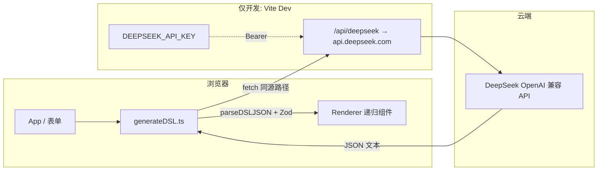

# 技术说明（展示用）

本文档说明本仓库的**技术选型与可讲亮点**，便于项目说明。项目定位为**纯前端 + 本地开发调用云端 LLM**，不依赖自建后端。

---

## 1. 目标与边界

- **目标**：自然语言 → **结构化 UI DSL（JSON）** → **同一套 schema** 校验 → **React 递归渲染**。
- **边界**：API Key 仅在 **`pnpm dev`** 时由 **Vite 开发服务器代理**注入请求头；不做独立后端，静态产物不包含密钥。

---

## 2. 架构（数据流）



**亮点**：密钥不落浏览器包；前端只打同源路径，鉴权在 Node 侧代理完成

---

## 3. DSL 设计

| 能力 | 说明 |
|------|------|
| **判别联合（discriminated union）** | `type` 字段区分 `text` / `button` / `image` / `input` / `card` / `container`，与 TypeScript 类型一一对应。 |
| **递归树** | `card` / `container` 的 `children` 为 `DSLNode[]`，支持任意深度嵌套。 |
| **Zod 4 运行时校验** | `src/schema/dslZod.ts` 用 `z.lazy` + `z.discriminatedUnion` 与 TS 类型对齐，不信任模型裸输出。 |
| **解析管线** | `parseDSL.ts`：剥 Markdown 代码围栏 → `JSON.parse` → `safeParse`，错误信息拼接路径便于调试。 |

---

## 4. 前端实现

- **React 19 + TypeScript 6**：递归 `Renderer`，与 DSL 树结构同构。
- **无障碍**：语义标签（如 `section`）、按钮 `aria-label`（含 action）、预览 `role="region"`；表单控件 `label` / `useId` 关联。
- **样式**：CSS 变量适配明暗主题（`index.css`），DSL 区块使用 `dsl-*` 类名集中维护。
- **包管理**：`packageManager` 锁定 **pnpm**，锁文件保证可复现安装。

---

## 5. AI 调用

- **协议**：OpenAI 兼容 `POST /v1/chat/completions`。
- **模型**：默认 `deepseek-chat`，可通过 `VITE_DEEPSEEK_MODEL` 切换（仅模型名，非密钥）。
- **提示词**：系统提示约束「只输出单个 JSON 对象」，降低胡扯概率；最终仍以 Zod 为准。

---

## 6. 质量与自动化（可选）

- **单元测试**：`src/lib/parseDSL.test.ts` 覆盖合法 DSL、围栏剥离、非法类型（Vitest）。
- **CI**：`.github/workflows/ci.yml` 执行 `pnpm install --frozen-lockfile`、`lint`、`build`、`test`。

---

## 7. 扩展方向（不讲后端的前提）

- 更多 DSL 节点类型（同一套路：**types → dslZod → Renderer → system prompt**）。
- `action` 白名单映射（toast / 路由占位），替代裸 `console.log`。
- 导出 / 导入 DSL JSON，方便离线演示与调试。

---

## 8. 本地运行（备忘）

```bash
pnpm install
# 配置 .env.local：DEEPSEEK_API_KEY=...
pnpm dev
```

详见仓库内 `.env.example`（若存在）。
